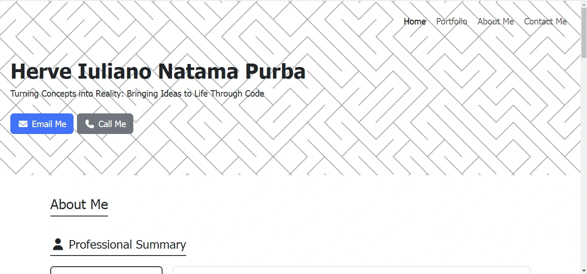

# Personal Profile & Portfolio Website

This repository contains the source code for my personal profile and portfolio website. It is designed to serve as a comprehensive online resume, showcasing my skills, professional experience, and a curated selection of my projects to potential employers and collaborators. The website is built with a mobile-first approach, ensuring a seamless experience across all devices.

## Live Demo

The website is hosted on GitHub Pages and can be accessed at the following URL:

**[https://herveinp.github.io/](https://herveinp.github.io/)**

## Website Preview

## Features

-   **Fully Responsive Design:** Adapts fluidly to desktops, tablets, and mobile phones using Bootstrap's grid system and custom media queries.
-   **Detailed About Me Section:** A comprehensive overview of my professional summary, work experience, education, skills, and certifications.
-   **Dynamic Portfolio Grid:** A responsive 3x3 grid showcasing my best projects. Each project card includes a screenshot, title, and a direct link to the live project.
-   **Functional Contact Form:** An integrated contact form that sends messages directly to my email using a serverless backend service (Formspree), suitable for static hosting environments.
-   **Semantic & Accessible HTML:** Structured with semantic HTML5 tags for better SEO and accessibility.
-   **Modern UI/UX:** Clean and professional design with subtle hover effects and animations for an enhanced user experience.

## Technologies Used

This project was built using modern front-end technologies and services:

-   **Frontend:**
    -   HTML5
    -   CSS3
    -   JavaScript (for Bootstrap components)

-   **Frameworks & Libraries:**
    -   [**Bootstrap 5**](https://getbootstrap.com/): For the responsive grid system, components (Navbar, Cards, Forms), and utility classes.
    -   [**Font Awesome**](https://fontawesome.com/): For high-quality icons used throughout the site.

-   **Backend & Deployment:**
    -   [**Formspree**](https://formspree.io/): As a serverless backend to handle contact form submissions on a static site.
    -   [**GitHub Pages**](https://pages.github.com/): For hosting the static website.

## Key Implementation Details

### Responsive Grid System
The portfolio section utilizes Bootstrap's powerful grid system to create a flexible layout. The classes `col-lg-4`, `col-md-6`, and the default stacking behavior for smaller screens ensure an optimal viewing experience:
-   **Desktops (`lg`):** 3 columns
-   **Tablets (`md`):** 2 columns
-   **Mobiles:** 1 column

### Static Site Contact Form
As GitHub Pages only supports static content, a traditional backend for processing forms is not possible. To solve this, this project leverages **Formspree**. The HTML form's `action` attribute points to a unique Formspree endpoint. When a user submits the form, the data is securely sent to Formspree, which then forwards it to my personal email address.

## Contact

-   **Herve Iuliano Natama Purba**
-   **Email:** `herve.inp@outlook.com`
-   **LinkedIn:** [linkedin.com/in/herveprba](https://linkedin.com/in/herveprba)

## License

This project is licensed under the MIT License. See the [MIT LICENSE](LICENSE) file for details.
